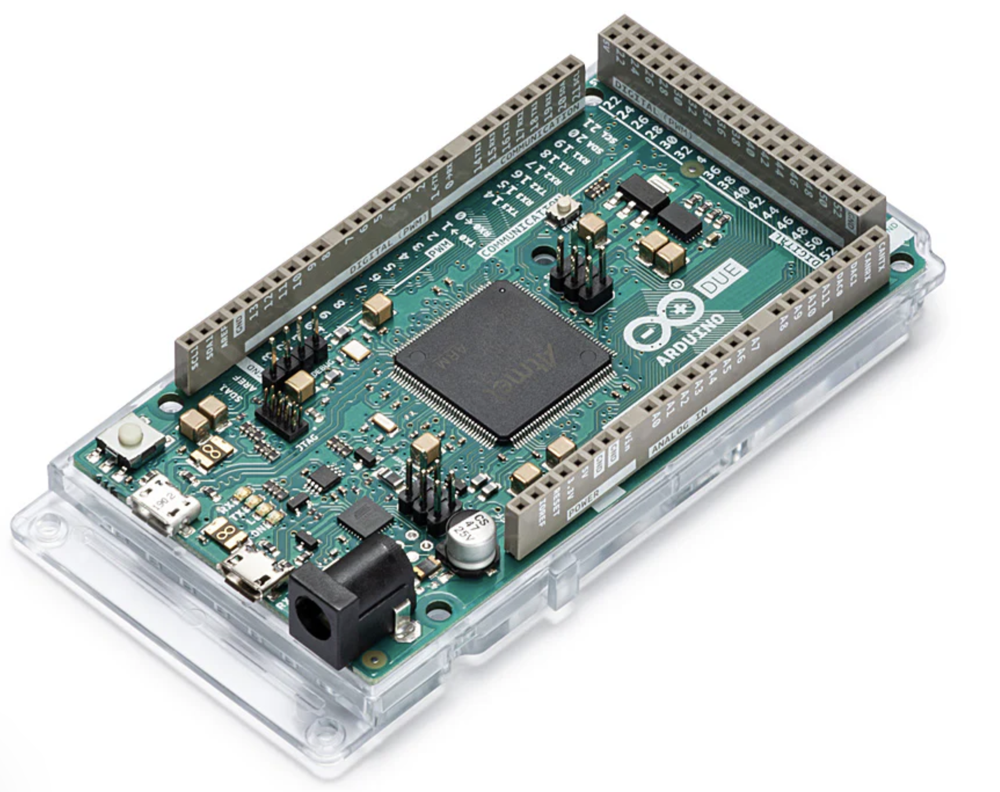
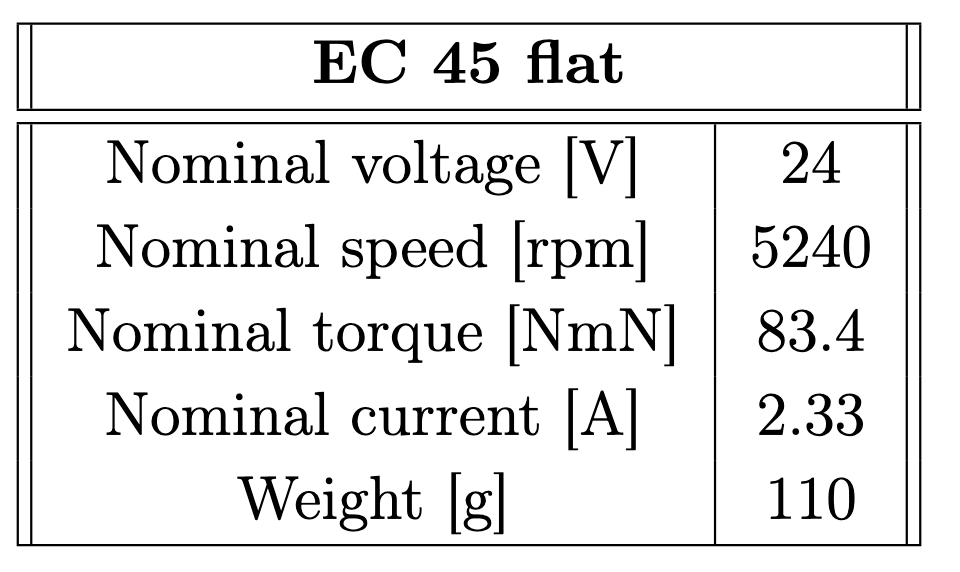
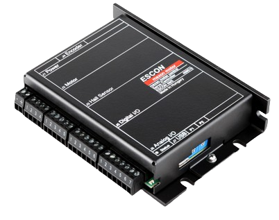
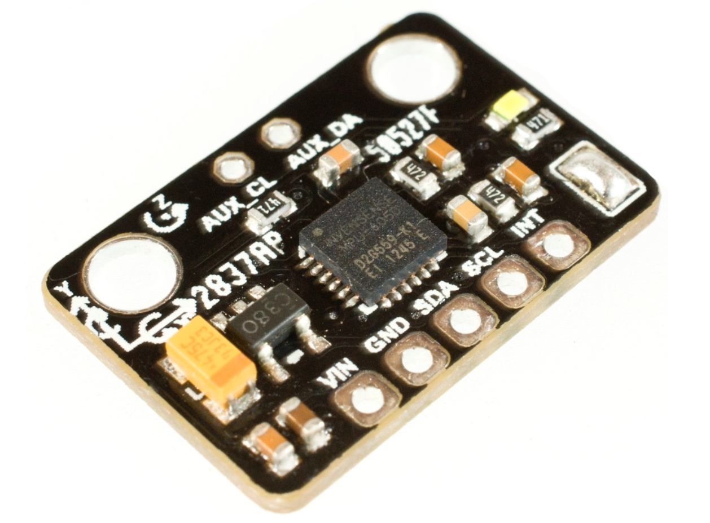

# Inverted Pendulum Actuated by a Reaction Wheel

This github repository contains the codes (Arduino and Matlab) and CAD files used to create a 2D inverted pendulum actuated by a reaction wheel. 
This project was carried out to support the teaching of control engineering at the SAAS (Service d’Automatique et d’Analyse des Systèmes, https://saas.ulb.ac.be/) laboratory at ULB. The resulting Master thesis text is also available in this repository under *'Master Thesis Text.pdf'*.

## Overview
It consists of a rigid pendulum rod placed on a surface which will be stabilized in the upright position using a motor coupled to a wheel placed on top of the pendulum as shown bellow. 

  

A video of the working prototype is available in the following link: https://www.youtube.com/shorts/VWwU4DCKMfk

The following sections provide a detailed description of the prototype development process. They cover the design and fabrication of 3D-printed components, the selection of the motor and its integration with the driver and the choice and programming of the microcontroller.

## Microcontroller
The Arduino Due was selected as the development board for this project due to its higher computational performance and advanced features. Its 84 MHz clock speed enables faster signal processing, essential for real-time applications. The Due provides a DAC (Digital-to-Analog Converter) for smoother analog outputs, as well as a larger SRAM (96 kB), allowing efficient handling of complex computations and storage of runtime variables.

  

The codes implemented on the microcontroller for controlling the pendulum are available in the folder 'Arduino'. 

- Scripts starting with *MPU6050* handle the data received from the Inertial Measurement Unit (IMU) and taken from: https://github.com/jrowberg/i2cdevlib
- File *Variables.ino* defines all variables used for the real time control of the pendulum
- File *main.ino* conatins the live script for controlling the pendulum

## Motor
The motor should be as lightweight as possible while also providing maximum torque. A Maxon brushless DC motor was selected: the EC 45 Flat. 

  

This type of motor offers an attractive price to performance ratio, a high torques due to external multipole rotor, and a flat and light design meant for limited space. 
The properties of the motor are shown in the table bellow.

  

Link for the motor: https://befr.rs-online.com/web/p/dc-motors/0495063
## Driver
In order to control the motor using the microcontroller, a driver needs to be used. A driver serves as the interface between the motor and the microcontroller to control the motor’s speed, direction or other parameter.

The ESCON 50/5 from Maxon compatible with the motor was chosen. 

  

It has 3 integrated operating modes: 

 - Current controller which compares the actual motor current with the applied set value and dynamically adjusts it in case of deviation
 - Closed loop speed controller that compares the actual speed with the applied set value and dynamically adjusts it
 - Open loop speed controller that feeds the motor with a voltage proportional to theset value; the load changes are compensated with IxR methodology

The properties of the driver are shown in the table bellow. 

  

The ESCON 50/5 is a programmable driver: on a software developed by Maxon, the user can enter the motor's propreties and select one of the 3 operating modes to control the motor. 

The following process was followed when laucnhing the start up wizard tool: 
- **Motor type**: Select maxon EC motor
- **Motor data**: Enter motor speed constant (285 rpm/V), thermal time constant winding (17.7s) and number of pole pairs (8)
- **System data**: Enter desired maximum speed (5240 rpm but you can increase if needed), nominal current (2.33 A) and max output current limit
- **Detection of rotor position**: Select digital Hall sensors with Maxon Hall sensor polarity
- **Speed sensor**: Select available Hall effect sensor
- **Mode of operation**: Select current controller
- **Enable**: Select your desired digital input with high active. In this situation, a switch was placed between digital Input 2 and the +5Vdc of the ESCON to easily enable the motor
- **Set value**: Select analog set value, with the analog input connected to the DAC pin of the microcontroller (here analog input 1). Since the Arduino DAC output is able to send voltages from 0.55 V to 2.75 V, the current sent at 0.55 V is set at -2.33 A and the current sent at 2.75 V is set at 2.33 A.
- ADD SPEED RAMP, OFFSET AND MINIMAL SPEED (need to check the computer for that)
- Add Analog output as well for understanding hall effect sensor outpur

A voltage of at least 22.79 V is required to power the ESCON 50/5 driving the EC45 Flat and a power supply of 24V has been selected. 

Link for the driver: https://www.maxongroup.fr/maxon/view/product/control/4-Q-Servokontroller/409510
## Sensors
### Inertial Measurement Unit (IMU)
To recover the pendulum angle and angular speed an inertial measurement unit can be used. It consists of a combination of accelerometer and gyroscope that allows to measure and report the angular rate of a structure. The accelerometer measures changes of acceleration in the sensor with respect to the earth while the gyroscope measures changing angular motion. The chosen IMU is the MPU6050 linked to an I2C bus for easier connection with the Arduino microcontroller 

  

It has a 3 axis gyroscope and accelerometer, allowing to recover the angle and acceleration in the 3 planes(x,y,z). Using the MPU6050 Arduino library from i2cdevlib, it is
possible to retrieve the Euler angles of the pendulum with the function **mpu.dmpGetEuler()**. By filtering the angle value and doing a derivative, the pendulum angular velocity can also be determined.

Link for the MPU6050: https://be.farnell.com/fr-BE/dfrobot/sen0142/6-dof-sensor-arduino-board/dp/3769961
### Hall effect sensors
To measure the motor’s properties, the EC 45 Flat comes with integrated Hall sensors. Hall sensors detect the magnetic field of a control magnet which is attached to the shaft.
The sensors are arranged between the stator teeth and monitor directly the poles of the magnetic ring with offsets of 120°. The Hall sensors evaluate the direction of the magnetic field and generate a high output (5V) if the north pole of the control magnet is close and a low output (GND) if the south pole is close.

The ESCON 50/5 can automatically recover the motor’s speed and send it via a programmable analog output. The Arduino Due board can recover an analog input range of 0 to 3.3V and the ESCON drier is programmed to send a voltage of 0 V for a speed of -5240 rpm and 3.3 V for a speed ot 5240 rpm.

## Wiring diagram
The wiring diagram of the inverted pendulum with reaction wheel is illustrated bellow.

  

## 3D design and printing
The prototype was mainly 3D-printed except for the pendulum rod made of carbon fiber (30cm long hollow cylinder of outer radius 7.5mm). All other components were designed on Fusion360 and 3D-printed in PLA. The CAD files are available in the folder *'Fusion360'*.

A short readme is available in this folder and explains the role of each component and how they are connected to each other. 

The final prototype is shown bellow.

  

## Matlab code for controlling the pendulum
A series of Matlab code and simulations is available in the folder *Matlab* of this Github. They were developed to establish the control laws to control the pendulum. 

Firstly, a mathematical model of the pendulum was developed and verified experimentally. This is developed in the section *'Mathematical model'* of the Master thesis text.  The code *'model_verif.m'* is used to superpose the experimental results to the simulation results computed by using Simulink file *'Verification_simulink.slx'*. The pendululm was placed upside down, with a current command of 1A during 1 second.

Codes *'Identification_TF.m'*, *'cost_TF.m'* and *'verification.m'* are used to identify and verify the transfer function of the motor (speed response to a current step input).

There are 2 controllers tested: a cascade PID controller and an Linear Quadratic Regulator. The LQR is tuned and the gain is computed using the code *'LQR.m'*, it can then be verified using the simulation *'RegulatorTesting.slx'*.

The cascade PID is tuned using code *'CascadePID.m'* and tested using simulation *'PIDcascadeTuning.slx'*.

Only the LQR worked experimentally, more details are available in the written master thesis.
